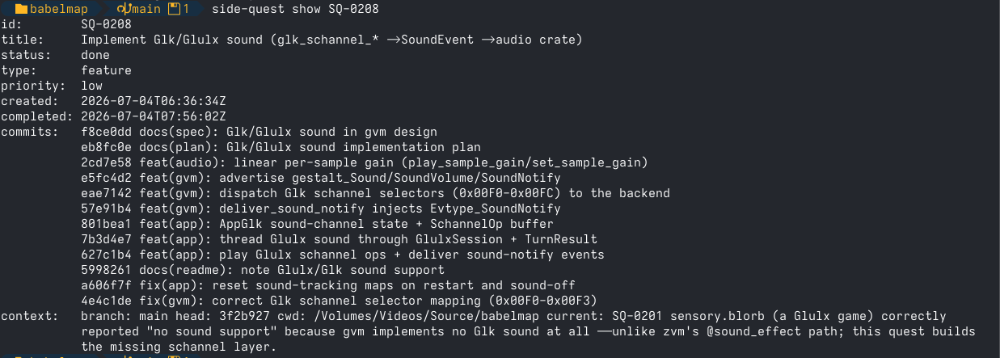
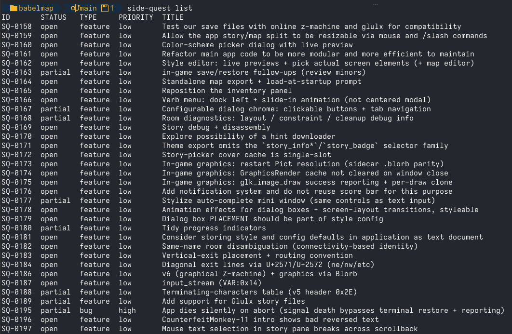

<p align="center">
  <picture>
    <source media="(prefers-color-scheme: dark)" srcset="docs/logo-dark.png">
    
  </picture>
</p>

# side-quest

> You're deep in architecting a new feature that is going to make your
> application rock. Out of the blue you have an insight that is going to change
> the world (or at least your application's world). The old way, you either
> derail and go off on that tangent, or you forget it by lunch. With
> side-quest, your agent just says *"captured as SQ-0042"*, and you never left
> the flow. Later, when you find some time to implement your inspiration, the
> commit links itself back to SQ-0042, no hand-written notes, no overhead, no
> bookkeeping.

*side-quest* is a git-native issue (i.e. *quest*) tracker built for rapid
development. It allows you to capture the tangents that surface mid-work
without breaking flow, and keep a clean two-way link between every quest and
the commits that resolve it. Quests are stored in your repo, driven by your
agent (MCP) or by you (CLI).

> **Status: CLI + MCP server + plugin packaging ready.** Quest store, git hooks,
> CLI, MCP server (`side-quest serve`), cross-machine sync, and the Claude Code
> plugin are built and tested.

## How it works

1. **Capture**: mid-task, an idea surfaces. Your agent (or you) files it as a
   quest in one call. No context switch; you keep working.
2. **Work**: when a commit addresses a quest, tag its message: `Quest: SQ-0042`
   (or `Confirm: SQ-0042` to park it for your sign-off, `Completes: SQ-0042` to
   close it). A `prepare-commit-msg` hook can fill
   this in from your *current* quest automatically. If using an AI Agent this is
   completely handled for you!
3. **Link**: a `post-commit` hook reads the trailer and writes the now-known
   commit hash back onto the quest. The task↔commit loop closes on its own.
4. **Sync**: every `git push` reconciles your quests with the remote's, so they
   travel with the repo and merge cleanly across machines and teammates.
5. **Magic**: The plugin (or `AGENTS.md` for non-Claude users) provides concise
   guidance to your AI. So, before you know it, your agent is automatically
   creating quests, assigning commits to them, and completing them with no
   input from you.

Quests live as one Markdown file each on a dedicated git ref
(`refs/side-quest/quests`), off your main history and never checked out — so they
travel with a clone but never clutter your working tree.

**→ For the storage model, compare-and-swap writes, the mutation flow, and id
allocation, see [`docs/architecture.md`](docs/architecture.md).**

### Quests Travel with your Repo

> ⚠️ **By default pushing the repo uploads your quests too.** Because quests
> live inside the repository, they travel with it on every push — so pushing to
> GitHub (or any remote) publishes **all** your quests and their full history
> alongside your code, including ones you've closed or discarded. A public repo
> makes them public; a shared private repo makes them visible to everyone with
> access. Don't put secrets, credentials, or anything you wouldn't want
> published into a quest's title, note, or body.

#### Optional Surf Punks _Locals Only_ Privacy Mode

If you want to keep things private, simply ask your agent to make your quests
local only so they won't get pushed to remote repos. Or you can do it yourself
with the cli:

```
side-quest config set local_only true
```

## Why it's different

Trusting your AI coding agent to remember something you brought up yesterday
(or even 15 minutes ago) is a recipe for disaster. You can use a TODO list, but
that is unreliable, and it can't cleanly link a task to the commit that
resolved it: a commit's hash doesn't exist until *after* the commit, and if the
task lives in the same repo, recording that hash needs another commit — with
its own hash. The loop never closes.

side-quest closes it: because quests live on a git ref, a `post-commit` hook
can write the hash back the moment it exists, as a separate commit on that ref
— no second commit on your branch, no manual step. The [architecture
notes](docs/architecture.md) walk through the full model.

As an individual developer this gives you 99% of the JIRA functionality you
care about with 0% of the overhead.

## Quickstart

**1. Install the Claude Code plugin** — registers the MCP server, the `/sq`
command, and the guidance skill, and auto-provisions the binary (downloaded and
checksum-verified):

```
/plugin marketplace add sharkusk/side-quest
```

```
/plugin install side-quest
```

> [!IMPORTANT]
> **On installs _and_ every update: wait for the binary to download, then start a
> fresh Claude Code session.** Provisioning fetches the matching `side-quest` binary
> in the background (a few seconds); until the MCP server is reloaded it keeps running
> the *previous* binary — stale tools, stale enums, **and stale guidance**. A `/mcp`
> reconnect or `/reload-plugins` refreshes the *tools*, but the agent's in-context
> guidance is read at session start, so **only a new session reliably loads updated
> guidance**. Verify with the `server_info` tool (or `side-quest version`): a version
> behind the latest release means the server is still on the old binary — finish the
> download and restart.

Using another MCP-capable agent? Follow
[Manual setup](docs/manual-setup.md) instead.

**2. Onboard each repo you want to track**: creates the quest ref and installs
the git hooks; safe to re-run. Ask your agent to run it, or from the root dir
of your repo use the side-quest command:

```
side-quest onboard
```

**3. Enable the terminal CLI (optional)**: Allows you to manage your quests
from the command line. The first *Onboard* command will prompt to install it.
Alternatively, you can ask your agent to enable it (it runs `cli_install`), or
[install the binary](docs/install.md) yourself.

**4. Capture your first quest**:

```
/sq fix the flaky parser test
```

The [plugin guide](docs/plugin.md) covers binary provisioning, per-repo setup,
and running the CLI from your own terminal in full.

## Using it

With the [Claude Code plugin](docs/plugin.md), the one action worth a keystroke —
capture — is a slash command: **`/sq <idea>`** files a new quest and drops you
straight back into what you were doing. It's capture-only, on purpose: that's the
"don't break flow" primitive. It also stores a bit of context, so when you go
back 2 weeks later it can help prime your memory on what you were doing when
you thought of the quest.

That last part is what costs `/sq` a turn of the conversation: restating the idea
and noting *why it came up* both need the session's context to write. When you
already know the words and would rather not touch the conversation at all,
capture from your own terminal instead — or with a leading `!` inside Claude
Code, which runs it without a model turn:

```
side-quest new "Fix the flaky parser test" --context "surfaced while fixing the timer refactor"
```

Everything else — list, show, status, link, note —
runs through your agent's `side-quest serve` MCP tools, and every action is also a
CLI command:

```
side-quest new "Fix the flaky parser test" --type bug --priority high
side-quest list                    # outstanding: open, partial + confirm quests
side-quest list --all              # every status, including done/deferred/discarded
side-quest list --filter "bug and not (done or deferred)"
side-quest show SQ-0001
side-quest status SQ-0001 done
side-quest note SQ-0001 "flaky since the timer refactor"
side-quest edit SQ-0001            # open the quest in $EDITOR, save to write it back
side-quest reclassify SQ-0001 --priority low
side-quest config set require_quest true
```



A bare `list` shows only outstanding quests (open, partial, and confirm); `--all`
includes every status, and `--filter` takes a boolean expression over bare enum
values (`bug`, `high`, `done`, …) and `key=value` tags with `and`/`or`/`not`/parens
— e.g. `--filter "not (done or deferred)"`. `show --history` prints a quest's
change log — who changed what, and when. Add `--json` to `new`, `list`, `show`, or
`config get` for machine-readable output. Flags may appear before or after the
title/id positional; `<id>` accepts shorthand (`side-quest show 1` = `SQ-0001`);
and every command prints its own help with `side-quest <command> -h`.

**→ For tag-based workflows** — tracking an upcoming release's scope with a shared
tag and generating release notes from the tagged quests — see
[Tips](docs/tips.md).



### The same loop, with an agent or without

side-quest needs no AI assistant — the git hooks and the quest↔commit link fire
the same whether a human or an agent writes the trailer. An agent just removes the
friction of *remembering* to capture.

**With an agent (Claude Code plugin):**

```text
you    /sq flaky parser test — started failing after the timer refactor
agent  Captured as SQ-0042.        ← you never left the diff

  … later …

you    let's fix that flaky parser test
agent  [pulls up SQ-0042, sets it current, writes the fix]
       Committing with "Completes: SQ-0042".
       → the post-commit hook links the hash back; SQ-0042 is done.
```

**On your own (CLI):**

```sh
# mid-task: capture the tangent, keep working — don't switch to it
side-quest new "Flaky parser test — fails since the timer refactor" --type bug
#   → SQ-0042

# later, when you actually start on it: make it the active quest
side-quest current SQ-0042

# do the work, then commit. the prepare-commit-msg hook fills in
# "Quest: SQ-0042" from the active quest — or write "Completes: SQ-0042"
# yourself to link *and* close in one shot
git commit -am "Fix flaky parser test"

# the post-commit hook already wrote the commit hash back onto SQ-0042;
# it's linked. mark it done:
side-quest status SQ-0042 done
```

Either way the commit and the quest end up linked both directions — no second
commit on your branch, nothing typed twice.

### Working with agents

What makes side-quest useful to an agent is the *guidance* it loads alongside the
tools — the reflex to capture a stray idea without derailing, and the
commit-trailer contract that links work to quests. **The MCP server carries that
core guidance itself**, delivered on connect and portable to any MCP client, so an
agent is primed the moment the server is registered — nothing added to your repo.

Two optional surfaces *reinforce* it when you want more than the baseline:

- [`skills/side-quest/SKILL.md`](skills/side-quest/SKILL.md) — the Claude-plugin
  form, loaded automatically by the [Claude Code plugin](docs/plugin.md) and
  surfaced as the `/sq` capture command.
- **Agent-agnostic guidance**, for non-Claude tools — run `side-quest agents-md`
  to print it, or `side-quest onboard --agents-md` to merge it into your
  project's own `AGENTS.md` as a marker-wrapped, version-stamped block it
  refreshes in place.

### Working with others

Once onboarded, quests sync automatically: every `git push` reconciles your quest
ref with the remote's, merging in anything a teammate or your other machine
added — no extra command. And cloning a repo that already has quests just works:
`side-quest onboard` in the clone pulls the existing set, so you start from the
team's quests rather than an empty ref. See [`docs/sync.md`](docs/sync.md) for how
the merge works, or run `side-quest sync` to reconcile without pushing (e.g. after
working offline). To wire the refspec by hand instead of via `onboard`, see
[Sharing quests across machines](docs/manual-setup.md#sharing-quests-across-machines).

## Show it off

Tracking your work with side-quest? Add a badge to your project's README:

[](https://github.com/sharkusk/side-quest)

```md
[](https://github.com/sharkusk/side-quest)
```

The doubled hyphen in `Side--Quest` is deliberate — [shields.io](https://shields.io)
reads a single `-` as a field separator, so a literal hyphen has to be escaped as
`--`. Swap the trailing `f97316` for any hex colour to match your palette.

## Development

- **Requirements:** Go ≥ 1.25; the system `git` binary (used as a subprocess);
  `gopkg.in/yaml.v3`; the MCP Go SDK. No CGo — a pure-Go static binary.
  [GoReleaser](https://goreleaser.com) is needed only to cut releases.
- **Layout:** `internal/` packages (`quest`, `config`, `gitcmd`, `store`,
  `trailer`, `voice`, `filter`) with the `cli` and `mcp` frontends under
  `cmd/side-quest`.
- **Build & test:**

  ```
  go build ./...
  go test ./...
  go vet ./...
  ```

- **CI:** the [`ci`](.github/workflows/ci.yml) workflow runs build/vet/test on
  Linux, macOS, and Windows for every push to `main` and every pull request. The
  Windows job is load-bearing, not incidental: it runs the end-to-end hook test
  under Git for Windows' MSYS `sh`, proving the extensionless shims actually fire
  and invoke the `.exe` — the one thing a Unix runner can't verify (SQ-0034).
- **Cutting a release:** bump `VERSION` and `plugin.json`'s `version` together, then
  `git tag v$(cat VERSION) && git push --tags`. The release workflow runs GoReleaser
  and publishes the six platform archives + `checksums.txt`. The build requires the
  Go toolchain named by the `go` directive in `go.mod` (currently **1.25**); CI pins
  it via `go-version-file: go.mod`, so bumping the directive moves the release
  toolchain with it. Validate the config locally with `goreleaser check` and
  `goreleaser build --snapshot --clean`.
- **Dogfooding side-quest on itself:** the repo's `.mcp.json` is the bare
  end-user reference (`side-quest serve`, resolved on `PATH`), so the MCP server
  runs whatever `side-quest` is installed — not your working tree. To point it and
  the git hooks at HEAD, run `make dev`: it `go install`s HEAD to your `GOBIN`
  (the binary both resolve to), refreshes the hook shims, and links the
  plugin's `/sq` command into `.claude/commands/`. (The shims are PATH-relative —
  they run whatever `side-quest` is first on `PATH` — so installing to `GOBIN` is
  what points them at HEAD.) Re-run `make dev` (or just
  `make install`) after code changes, then **restart the MCP server** so it
  reloads the new binary. There's no separate MCP artifact to update — `serve`
  *is* the binary. `make` builds self-stamp the version from `git describe`, so
  `side-quest version` (and the server's advertised version) report the exact
  commit — if the running server names an older commit than your `HEAD`, that's
  your cue you skipped the restart.
- **Dogfooding your dev build on another repo:** `make install` puts HEAD on your
  `PATH` (via `GOBIN`), and `PATH` is global — so a dev build is available in any
  repo. In the *other* repo, once: run `side-quest onboard` (any copy works —
  the hook shims are PATH-relative, so they always run whatever `side-quest` is
  first on `PATH`, which `make install` keeps current). That creates the quest ref, installs hooks,
  writes `.mcp.json`, and merges the guidance into that repo's `AGENTS.md` as a
  marker-wrapped block it can later refresh in place; add `/sq` by
  installing the plugin globally or symlinking `commands/sq.md` into that repo's
  `.claude/commands/`. Steady state: edit side-quest → `make install` here →
  **restart the MCP server** there (hooks need no re-install — they resolve
  `side-quest` from `PATH` at run time). Prefer a scratch `git init` repo over a live project for a
  work-in-progress build: side-quest only ever writes `refs/side-quest/*` and
  `.git/hooks` (never your branches/index/worktree), so your code is safe, but a
  buggy build could still corrupt *quest* data.
- **Developing side-quest while using it elsewhere:** keep the released
  `side-quest` on your `PATH` for the project you track in production; for
  development, build a local `./side-quest` (`go build -o side-quest ./cmd/side-quest`)
  and invoke it explicitly. Never point a work-in-progress binary at a live repo —
  run it against the side-quest repo itself or throwaway `git init` scratch repos
  (the test suite already isolates via temp repos). Quest data is per-repo on
  `refs/side-quest/*`, so working in this repo cannot touch another project's quests.
