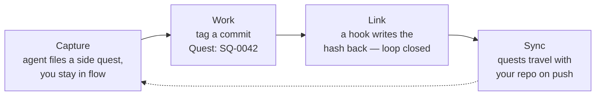
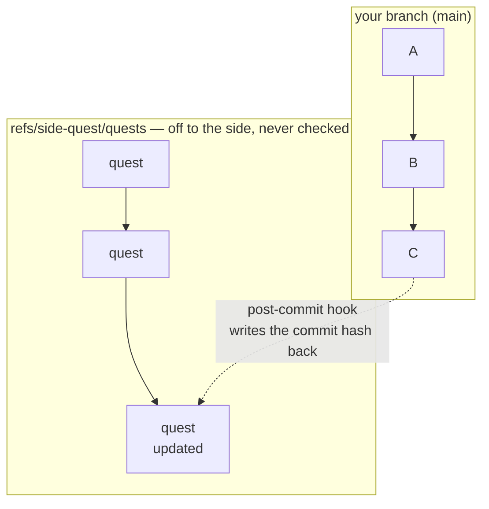

<p align="center">
  <picture>
    <source media="(prefers-color-scheme: dark)" srcset="docs/logo-dark.png">
    
  </picture>
</p>

# side-quest

> You're deep in a refactor. Your agent spots a flaky test three files away. The
> old way, you either derail to go fix it or you forget it by lunch. With
> side-quest, your agent just says *"captured as SQ-0042"* — and you never left
> the diff. Later, the commit that fixes it links itself back to SQ-0042, no
> bookkeeping.

side-quest is a git-native issue tracker built for that loop: capture the
tangents that surface mid-work without breaking flow, and keep a clean two-way
link between every quest and the commits that resolve it. One Go binary, quests
stored in your repo, driven by your agent (MCP) or by you (CLI).

```
/plugin install side-quest      # Claude Code — auto-provisions the binary
```

> **Status: CLI + MCP server + plugin packaging ready.** Quest store, git hooks,
> CLI, MCP server (`side-quest serve`), cross-machine sync, and the Claude Code
> plugin are built and tested.



## How it works

1. **Capture** — mid-task, an idea surfaces. Your agent (or you) files it as a
   quest in one call. No context switch; you keep working.
2. **Work** — when a commit addresses a quest, tag its message: `Quest: SQ-0042`
   (or `Completes: SQ-0042` to close it). A `prepare-commit-msg` hook can fill
   this in from your *current* quest automatically.
3. **Link** — a `post-commit` hook reads the trailer and writes the now-known
   commit hash back onto the quest. The task↔commit loop closes on its own.
4. **Sync** — every `git push` reconciles your quests with the remote's, so they
   travel with the repo and merge cleanly across machines and teammates.

Quests live as one Markdown file each on a dedicated git ref
(`refs/side-quest/quests`), off your main history and never checked out — so they
travel with a clone but never clutter your working tree.



**→ For the storage model, compare-and-swap writes, the mutation flow, and id
allocation, see [`docs/architecture.md`](docs/architecture.md).**

## Why it's different

Most trackers can't cleanly link a task to the commit that resolved it: a
commit's hash doesn't exist until *after* the commit, and if the task lives in
the same repo, recording that hash needs another commit — with its own hash. The
loop never closes. side-quest closes it: because quests live on a git ref, a
`post-commit` hook can write the hash back the moment it exists, as a separate
commit on that ref — no second commit on your branch, no manual step. The
[architecture notes](docs/architecture.md) walk through the full model.

## Quickstart

**1. Get side-quest running with your agent — pick one:**

- **[Claude Code plugin](docs/plugin.md)** (recommended) —
  `/plugin install side-quest` registers the MCP server, the `/sq` command, and
  the guidance skill, and **auto-provisions the binary** (downloaded and
  checksum-verified). No separate install.
- **[Manual setup](docs/manual-setup.md)** — for any MCP-capable agent:
  [install the binary](docs/install.md) yourself, then register the MCP server
  and merge side-quest's guidance into your `AGENTS.md`.

**2. Set up each repo you want to track** — run `side-quest onboard` once: it
creates the quest ref, installs the git hooks, writes a project `.mcp.json` if
absent, and merges side-quest's guidance into the project's `AGENTS.md`. Safe to
re-run after an upgrade — the guidance is a marker-wrapped, version-stamped block
`onboard` refreshes in place (your own `AGENTS.md` content is left untouched).
(Or do it by hand with `side-quest init` + `side-quest install-hooks`.)

**3. Capture your first quest** — ask your agent to note a follow-up, type
`/sq fix the flaky parser test` (Claude Code plugin), or run
`side-quest new "Fix the flaky parser test" --type bug`. That's the loop
started.

## Using it

With the [Claude Code plugin](docs/plugin.md), the one action worth a keystroke —
capture — is a slash command: **`/sq <idea>`** files a new quest and drops you
straight back into what you were doing. It's capture-only, on purpose: that's the
"don't break flow" primitive. Everything else — list, show, status, link, note —
runs through your agent's `side-quest serve` MCP tools, and every action is also a
CLI command:

```
side-quest new "Fix the flaky parser test" --type bug --priority high
side-quest list                    # outstanding work: open + partial quests
side-quest list --all              # every status, including done/deferred/discarded
side-quest list --filter "bug and not (done or deferred)"
side-quest show SQ-0001
side-quest status SQ-0001 done
side-quest note SQ-0001 "flaky since the timer refactor"
side-quest edit SQ-0001            # open the quest in $EDITOR, save to write it back
side-quest reclassify SQ-0001 --priority low
side-quest config set require_quest true
```

<!-- TODO: real terminal screenshot — capturing a side quest mid-task -->


<!-- TODO: real terminal screenshot — side-quest list -->


A bare `list` shows only outstanding quests (open + partial); `--all` includes
every status, and `--filter` takes a boolean expression over bare enum values
(`bug`, `high`, `done`, …) and `key=value` tags with `and`/`or`/`not`/parens —
e.g. `--filter "not (done or deferred)"` — replacing the simple filter flags
rather than combining with them. Add `--json` to `new`, `list`, `show`, or
`config get` for machine-readable output. Flags may appear before or after the
title/id positional; `<id>` accepts shorthand (`side-quest show 1` = `SQ-0001`);
and every command prints its own help with `side-quest <command> -h`.

**Tip — a shorter `sq`.** `side-quest` is a lot to type. Alias it to `sq`, which
matches the plugin's `/sq` slash command:

```sh
# bash / zsh — add to ~/.bashrc or ~/.zshrc
alias sq=side-quest
```

```powershell
# PowerShell — add to $PROFILE
Set-Alias sq side-quest
```

(An alias, not a shipped binary, so it works the same however you installed
side-quest.)

### The same loop, with an agent or without

side-quest needs no AI assistant — the git hooks and the quest↔commit link fire
the same whether a human or an agent writes the trailer. An agent just removes the
friction of *remembering* to capture.

**With an agent (Claude Code plugin):**

```text
you    /sq flaky parser test — started failing after the timer refactor
agent  Captured as SQ-0042.        ← you never left the diff

  … later …

you    let's fix that flaky parser test
agent  [pulls up SQ-0042, sets it current, writes the fix]
       Committing with "Completes: SQ-0042".
       → the post-commit hook links the hash back; SQ-0042 is done.
```

**On your own (CLI):**

```sh
# mid-task: capture the tangent, keep working — don't switch to it
side-quest new "Flaky parser test — fails since the timer refactor" --type bug
#   → SQ-0042

# later, when you actually start on it: make it the active quest
side-quest current SQ-0042

# do the work, then commit. the prepare-commit-msg hook fills in
# "Quest: SQ-0042" from the active quest — or write "Completes: SQ-0042"
# yourself to link *and* close in one shot
git commit -am "Fix flaky parser test"

# the post-commit hook already wrote the commit hash back onto SQ-0042;
# it's linked. mark it done:
side-quest status SQ-0042 done
```

Either way the commit and the quest end up linked both directions — no second
commit on your branch, nothing typed twice.

### Working with agents

What makes side-quest useful to an agent is the *guidance* it loads alongside the
tools — the reflex to capture a stray idea without derailing, and the
commit-trailer contract that links work to quests. That guidance ships as two
mirrored files:

- [`AGENTS.md`](AGENTS.md) — agent-agnostic. `side-quest onboard` merges it into
  your project's own `AGENTS.md` as a marker-wrapped, version-stamped block it
  can refresh in place on later upgrades; `side-quest agents-md` prints the block
  for a manual paste.
- [`skills/side-quest/SKILL.md`](skills/side-quest/SKILL.md) — the same guidance
  in Claude-plugin form, loaded automatically by the
  [Claude Code plugin](docs/plugin.md) and surfaced as the `/sq` capture command.

### Working with others

Once onboarded, quests sync automatically: every `git push` reconciles your quest
ref with the remote's, merging in anything a teammate or your other machine
added — no extra command. See [`docs/sync.md`](docs/sync.md) for how the merge
works, or run `side-quest sync` to reconcile without pushing (e.g. after working
offline). To wire the refspec by hand instead of via `onboard`, see
[Sharing quests across machines](docs/manual-setup.md#sharing-quests-across-machines).

## Development

- **Requirements:** Go ≥ 1.25; the system `git` binary (used as a subprocess);
  `gopkg.in/yaml.v3`; the MCP Go SDK. No CGo — a pure-Go static binary.
  [GoReleaser](https://goreleaser.com) is needed only to cut releases.
- **Layout:** `internal/` packages (`quest`, `config`, `gitcmd`, `store`,
  `trailer`, `voice`, `filter`) with the `cli` and `mcp` frontends under
  `cmd/side-quest`.
- **Build & test:**

  ```
  go build ./...
  go test ./...
  go vet ./...
  ```

- **CI:** the [`ci`](.github/workflows/ci.yml) workflow runs build/vet/test on
  Linux, macOS, and Windows for every push to `main` and every pull request. The
  Windows job is load-bearing, not incidental: it runs the end-to-end hook test
  under Git for Windows' MSYS `sh`, proving the extensionless shims actually fire
  and invoke the `.exe` — the one thing a Unix runner can't verify (SQ-0034).
- **Cutting a release:** bump `VERSION` and `plugin.json`'s `version` together, then
  `git tag v$(cat VERSION) && git push --tags`. The release workflow runs GoReleaser
  and publishes the six platform archives + `checksums.txt`. The build requires the
  Go toolchain named by the `go` directive in `go.mod` (currently **1.25**); CI pins
  it via `go-version-file: go.mod`, so bumping the directive moves the release
  toolchain with it. Validate the config locally with `goreleaser check` and
  `goreleaser build --snapshot --clean`.
- **Dogfooding side-quest on itself:** the repo's `.mcp.json` is the bare
  end-user reference (`side-quest serve`, resolved on `PATH`), so the MCP server
  runs whatever `side-quest` is installed — not your working tree. To point it and
  the git hooks at HEAD, run `make dev`: it `go install`s HEAD to your `GOBIN`
  (the binary both resolve to), re-points the hook shims at it, and links the
  plugin's `/sq` command into `.claude/commands/`. Re-run `make dev` (or just
  `make install`) after code changes, then **restart the MCP server** so it
  reloads the new binary. There's no separate MCP artifact to update — `serve`
  *is* the binary. `make` builds self-stamp the version from `git describe`, so
  `side-quest version` (and the server's advertised version) report the exact
  commit — if the running server names an older commit than your `HEAD`, that's
  your cue you skipped the restart.
- **Dogfooding your dev build on another repo:** `make install` puts HEAD on your
  `PATH` (via `GOBIN`), and `PATH` is global — so a dev build is available in any
  repo. In the *other* repo, once: run `~/go/bin/side-quest onboard` (use the
  `GOBIN` binary explicitly so the hook shims bake in that stable path, which
  `make install` keeps refreshing). That creates the quest ref, installs hooks,
  writes `.mcp.json`, and merges the guidance into that repo's `AGENTS.md` as a
  marker-wrapped block it can later refresh in place; add `/sq` by
  installing the plugin globally or symlinking `commands/sq.md` into that repo's
  `.claude/commands/`. Steady state: edit side-quest → `make install` here →
  **restart the MCP server** there (hooks need no re-install — they point at
  `GOBIN/side-quest`). Prefer a scratch `git init` repo over a live project for a
  work-in-progress build: side-quest only ever writes `refs/side-quest/*` and
  `.git/hooks` (never your branches/index/worktree), so your code is safe, but a
  buggy build could still corrupt *quest* data.
- **Developing side-quest while using it elsewhere:** keep the released
  `side-quest` on your `PATH` for the project you track in production; for
  development, build a local `./side-quest` (`go build -o side-quest ./cmd/side-quest`)
  and invoke it explicitly. Never point a work-in-progress binary at a live repo —
  run it against the side-quest repo itself or throwaway `git init` scratch repos
  (the test suite already isolates via temp repos). Quest data is per-repo on
  `refs/side-quest/*`, so working in this repo cannot touch another project's quests.
